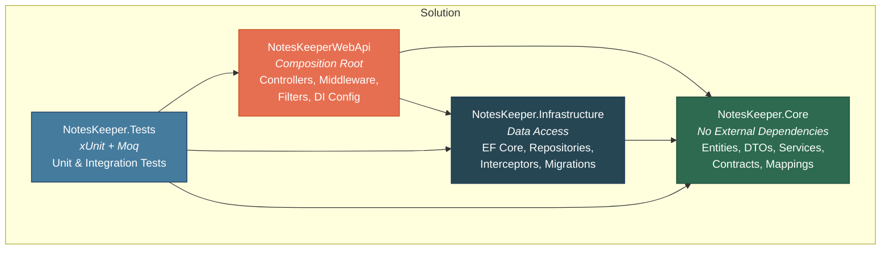

# NotesKeeper API

A RESTful Web API for managing personal notes, tags, and reminders — built with ASP.NET Core 10 as a learning project to explore Clean Architecture, JWT authentication, Entity Framework Core, and various middleware patterns.

## What This Project Covers

### Clean Architecture

The solution is organized into four projects with strict dependency rules:



- **Core** has zero external dependencies — it contains domain entities, DTOs, service contracts, service implementations, and mapping extensions. Business logic never touches EF Core or HTTP directly.
- **Infrastructure** depends only on Core. It implements repository contracts using EF Core and SQL Server.
- **WebApi** is the composition root — it wires everything together via DI and hosts controllers, middleware, and filters.
- **Tests** references all three to support both unit and integration testing.

### Interface Segregation Principle (ISP)

Instead of one large `INoteRepository` or `INoteService`, each operation has its own interface:

```
INoteAddRepository, INoteGetRepository, INoteUpdateRepository, INoteDeleteRepository
INoteAddService,    INoteGetService,    INoteUpdateService,    INoteDeleteService
```

A single class (`NoteService`, `NoteRepository`) implements all of them, but consumers only depend on the slice they need. This makes DI registrations explicit and keeps method signatures focused.

### JWT Authentication with Refresh Tokens

- Access tokens are generated with claims (`sub`, `jti`, `iat`, email, name, role) and signed with HMAC-SHA256.
- Refresh tokens are cryptographically random 32-byte values stored on the `ApplicationUser` entity.
- `GetPrincipalFromExpiredToken` validates the signing algorithm to prevent algorithm-swap attacks before extracting claims.
- A global `AuthorizeFilter` requires authentication on every endpoint by default — individual actions opt out with `[AllowAnonymous]`.

### Email Confirmation Flow

Registration doesn't issue tokens immediately. Instead it redirects to an email confirmation link generator. Tokens are only issued after the user confirms their email address via `ConfirmEmailAsync`.

### Entity Framework Core Patterns

**SaveChanges Interceptors** — Two interceptors hook into `SavingChangesAsync`:
- `SoftDeleteInterceptor` — catches `EntityState.Deleted` on `ISoftDeletable` entities, flips them to `Modified`, and sets `IsDeleted = true`. For tags, it also loads and removes related `TagsAssignments` to keep referential integrity.
- `DateOfCreationInterceptor` — catches `EntityState.Added` on `IAtDateCreatable` entities and sets `CreatedAt = DateTime.UtcNow`.

**Global Query Filters** — Tags use `HasQueryFilter(t => !t.IsDeleted)` so soft-deleted tags are automatically excluded from all queries without any extra `Where` clauses.

**SQL Schemas** — Entities are organized into database schemas (`Contents` for Notes/Tags/TagsAssignments, `Notifications` for Reminders) using `.ToTable("Name", schema: "Schema")` in `OnModelCreating`.

**Expression Conversion** — Repository contracts accept `Expression<Predicate<T>>` (for semantic clarity), but EF Core LINQ needs `Expression<Func<T, bool>>`. A utility `ExpressionConverter.ToFuncExpression()` handles the translation by reusing the expression body and parameters.

### Custom Authorization Filters

- `UserCheckFilter` — An `IAsyncAuthorizationFilter` that extracts the `UserId` header and compares it against the `NameIdentifier` claim in the JWT. Prevents users from mutating resources belonging to other users. Applied at controller level via `[TypeFilter(typeof(UserCheckFilter))]`.
- `NoteUserAuthFilter` — Applied on individual note actions (delete, update, get by ID) for fine-grained ownership checks.

### API Versioning

Header-based versioning using the `api-version` header. Controllers inherit from `CustomControllerBase` which sets `[ApiVersion("1.0")]`. Swagger is configured with separate endpoints for v1 and v2.

### Rate Limiting

Four rate limiter policies are configured to explore different strategies:
- **Fixed Window** — 60 requests per 10-second window
- **Sliding Window** — 100 requests across a 30-second window split into 3 segments
- **Token Bucket** — 100 token capacity, replenishing 20 tokens every 10 seconds
- **Concurrency** — Maximum 10 concurrent requests

Login and registration endpoints use the sliding window limiter to protect against brute force and spam.

### Background Services

`ReminderNotificationService` is a `BackgroundService` that polls every minute for due reminders. It uses `IServiceScopeFactory` to create scoped service instances (since background services are singletons and can't inject scoped services directly).

### Structured Logging

Serilog is configured with three sinks:
- **File** — Rolling daily log files in `logs/`
- **SQL Server** — Logs persisted to a `Logs` table (auto-created)
- **Seq** — For structured log searching and dashboards during development

All log calls use structured logging with `{Placeholder}` syntax, never string interpolation — this preserves queryable properties in Seq/SQL.

### Global Exception Handling

A custom middleware catches all unhandled exceptions, logs them as `Critical`, and returns a standard `ProblemDetails` JSON response with the `traceId` for correlation — instead of leaking stack traces.

### Testing Strategy

**Unit Tests** — Service classes are tested by mocking repository interfaces with Moq. Each test covers both success and failure paths.

**Integration Tests** — `CustomWebApplicationFactory` replaces the real auth pipeline with a test scheme that auto-authenticates, swaps all service registrations with mocks, and removes the background service. This lets tests exercise the full HTTP pipeline (routing, filters, model binding, serialization) without a database.

### Other Patterns

- **Extension method mapping** (`ToNote()`, `ToNoteResponse()`, `ToUser()`) instead of AutoMapper — explicit, debuggable, zero magic
- **CORS** configured for an Angular frontend origin
- **DinkToPdf** integration for HTML-to-PDF conversion
- **Many-to-many** relationships with an explicit join entity (`TagsAssignments`) and composite key

## API Endpoints

All endpoints require JWT authentication unless marked with `[AllowAnonymous]`. Versioning is via the `api-version` header (default: `1.0`).

### Authentication (`/api/account`)

| Method | Endpoint | Auth | Description |
|--------|----------|------|-------------|
| `POST` | `/register` | No | Register a new user (rate limited). Redirects to email confirmation. |
| `POST` | `/login` | No | Authenticate and receive JWT + refresh token (rate limited). |
| `GET` | `/logout` | Yes | Sign out the current user. |
| `POST` | `/refresh-token` | No | Exchange an expired JWT + valid refresh token for a new pair. |
| `GET` | `/email-token-gen/{userId}` | No | Generate an email confirmation link for a user. |
| `GET` | `/confirm-email/{userId}?emailConfirmationToken=...` | No | Confirm email and receive JWT tokens. |
| `GET` | `/IsEmailAlreadyUsed?email=...` | No | Check if an email is already registered. |

### Notes (`/api/note`)

Requires `UserId` header matching the JWT claim.

| Method | Endpoint | Description |
|--------|----------|-------------|
| `POST` | `/` | Create a new note. |
| `GET` | `/{noteId}` | Get a note by ID (ownership verified). |
| `PUT` | `/{noteId}` | Update a note's title and body (ownership verified). |
| `DELETE` | `/{noteId}` | Delete a note (ownership verified). |
| `GET` | `/user` | Get all notes for the authenticated user. |
| `GET` | `/search/{title}` | Search user's notes by title. |
| `GET` | `/tag/{tagId}` | Get user's notes filtered by tag ID. |
| `GET` | `/tag/search/{tagName}` | Get user's notes filtered by tag name. |
| `PUT` | `/tag/assign/{noteId}` | Assign a tag to a note (body: `tagId`). |
| `PUT` | `/tag/remove/{noteId}` | Remove a tag from a note (body: `tagId`). |
| `POST` | `/reminder/{noteId}` | Create a reminder and attach it to a note. |
| `PUT` | `/reminder/{noteId}/{reminderId}` | Update an existing reminder on a note. |
| `DELETE` | `/reminder/{noteId}` | Remove and delete a reminder from a note (body: `reminderId`). |

### Tags (`/api/tag`)

Requires `UserId` header matching the JWT claim.

| Method | Endpoint | Description |
|--------|----------|-------------|
| `POST` | `/` | Create a new tag. |
| `GET` | `/{tagId}` | Get a tag by ID. |
| `GET` | `/{name}` | Search tags by name. |
| `GET` | `/user/{userId}` | Get all tags for a user. |
| `PUT` | `/{tagId}` | Update a tag's name and comment. |
| `DELETE` | `/{tagId}` | Soft-delete a tag. |

### File Export (`/api/file`) — v2

| Method | Endpoint | Description |
|--------|----------|-------------|
| `GET` | `/export/note/{noteId}` | Export a note as a styled PDF (rate limited: concurrency). |

## Tech Stack

| Layer | Technology |
|-------|-----------|
| Framework | ASP.NET Core 10 (.NET 10) |
| Database | SQL Server via EF Core 10 |
| Auth | ASP.NET Core Identity + JWT Bearer |
| Logging | Serilog (File, SQL Server, Seq) |
| API Docs | Swashbuckle (Swagger UI) |
| Testing | xUnit, Moq, Microsoft.AspNetCore.Mvc.Testing |
| PDF | DinkToPdf |

## Getting Started

### Prerequisites

- [.NET 10 SDK](https://dotnet.microsoft.com/download)
- SQL Server (local or remote)
- [Seq](https://datalust.co/seq) (optional, for structured log viewing)

### Setup

```bash
# Clone and navigate to the project
cd NotesKeeper

# Set up user secrets (connection string and JWT config)
dotnet user-secrets set "ConnectionStrings:NotesKeeper" "Server=.;Database=NotesKeeper;Trusted_Connection=True;TrustServerCertificate=True" --project src/NotesKeeperWebApi
dotnet user-secrets set "Jwt:Key" "your-256-bit-secret-key-here-min-32-chars" --project src/NotesKeeperWebApi
dotnet user-secrets set "Jwt:Issuer" "https://localhost" --project src/NotesKeeperWebApi
dotnet user-secrets set "Jwt:Audience" "https://localhost" --project src/NotesKeeperWebApi
dotnet user-secrets set "Jwt:Exp" "30" --project src/NotesKeeperWebApi
dotnet user-secrets set "Jwt:RefreshTokenExp" "1440" --project src/NotesKeeperWebApi

# Apply migrations
dotnet ef database update --project src/NotesKeeper.Infrastructure --startup-project src/NotesKeeperWebApi

# Run
dotnet run --project src/NotesKeeperWebApi
```

Swagger UI is available at the root (`/`) in Development mode.

### Running Tests

```bash
# All tests
dotnet test src/NotesKeeper.Tests

# Single test
dotnet test src/NotesKeeper.Tests --filter "FullyQualifiedName~NoteServiceTests.AddNote_ValidRequest_ReturnsNoteResponse"
```

## Project Structure

```
src/
  NotesKeeper.Core/            # Domain, DTOs, Services, Contracts
  NotesKeeper.Infrastructure/  # EF Core, Repositories, Interceptors, Migrations
  NotesKeeperWebApi/           # Controllers, Middleware, Filters, DI Config
  NotesKeeper.Tests/           # Unit + Integration Tests
```
